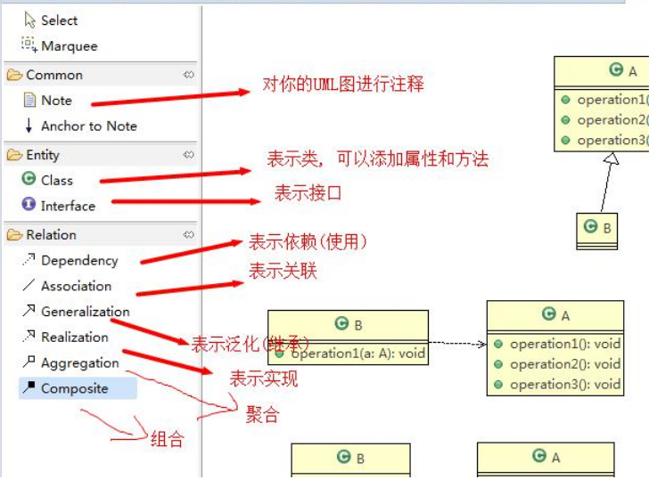

# 设计模式

## 设计模式七大原则

设计模式原则其实就是程序员在编程时应当遵守的原则，也是各种设计模式的基础

### 单一职责原则

==一个类应该只负责一项职责==

如类 A 负责两个不同职责：职责 1，职责 2。当职责 1 需求变更而改变 A 时，可能造成职责 2 执行错误

所以需要将类 A 的粒度分解为 A1，A2


#### 违反原则

```java
public class SingleResponsibility1 {
    public static void main(String[] args) {
        // TODO Auto-generated method stub
        Vehicle vehicle = new Vehicle();
        vehicle.run("摩托车");
        vehicle.run("汽车");
        vehicle.run("飞机");
    }
}

class Vehicle {
    public void run(String vehicle) {
        System.out.println(vehicle + " 在公路上运行....");
    }
}
```

解决的方案非常的简单，根据交通工具运行方法不同，分解成不同类即可

#### 遵守原则

```java
package com.atguigu.principle.singleresponsibility;

public class SingleResponsibility2 {
	public static void main(String[] args) {
		// TODO Auto-generated method stub
		RoadVehicle roadVehicle = new RoadVehicle();
		roadVehicle.run("摩托车");
		roadVehicle.run("汽车");
		
		AirVehicle airVehicle = new AirVehicle();
		airVehicle.run("飞机");
	}
}

class RoadVehicle {
	public void run(String vehicle) {
		System.out.println(vehicle + "公路运行");
	}
}

class AirVehicle {
	public void run(String vehicle) {
		System.out.println(vehicle + "天空运行");
	}
}

class WaterVehicle {
	public void run(String vehicle) {
		System.out.println(vehicle + "水中运行");
	}
}
```

### 接口隔离原则

客户端不应该依赖它不需要的接口，即==一个类对另一个类的依赖应该建立在最小的接口上==


#### 违背原则

类 A 通过接口 Interface1 依赖类 B，类 C 通过接口 Interface1 依赖类 D

如果接口 Interface1 对于类 A 和类 C来说不是最小接口，那么类 B 和类 D 必须去实现他们不需要的方法

代码就会额外冗长

```java
interface Interface1 {
    void operation1();
    void operation2();
    void operation3();
    void operation4();
    void operation5();
}

class B implements Interface1 {
    @Override
    public void operation1() {
        System.out.println("B 实现了 operation1");
    }
    @Override
    public void operation2() {
        System.out.println("B 实现了 operation2");
    }
    @Override
    public void operation3() {
        System.out.println("B 实现了 operation3");
    }
    @Override
    public void operation4() {
        System.out.println("B 实现了 operation4");
    }
    @Override
    public void operation5() {
        System.out.println("B 实现了 operation5");
    }
}

class D implements Interface1 {
    @Override
    public void operation1() {
        System.out.println("D 实现了 operation1");
    }
    @Override
    public void operation2() {
        System.out.println("D 实现了 operation2");
    }
    @Override
    public void operation3() {
        System.out.println("D 实现了 operation3");
    }
    @Override
    public void operation4() {
        System.out.println("D 实现了 operation4");
    }
    @Override
    public void operation5() {
        System.out.println("D 实现了 operation5");
    }
}

class A { //A 类通过接口Interface1 依赖(使用) B类，但是只会用到1,2,3方法
    public void depend1(Interface1 i) {
        i.operation1();
    }
    public void depend2(Interface1 i) {
        i.operation2();
    }
    public void depend3(Interface1 i) {
        i.operation3();
    }
}

class C { //C 类通过接口Interface1 依赖(使用) D类，但是只会用到1,4,5方法
    public void depend1(Interface1 i) {
        i.operation1();
    }
    public void depend4(Interface1 i) {
        i.operation4();
    }
    public void depend5(Interface1 i) {
        i.operation5();
    }
}
```

类图简单但是过分冗余


#### 遵守原则

按隔离原则应当这样处理：
将接口 Interface1 拆分为独立的几个接口(这里我们拆分成 3 个接口)，类 A 和类 C 分别与他们需要的接口建立
依赖关系。

```java
package com.atguigu.principle.segregation.improve;

public class Segregation1 {
    public static void main(String[] args) {
        A a = new A();
        a.depend1(new B()); // A类通过接口去依赖B类
        a.depend2(new B());
        a.depend3(new B());
        
        C c = new C();
        c.depend1(new D()); // C类通过接口去依赖D类
        c.depend4(new D());
        c.depend5(new D());
    }
}

interface Interface1 {
    void operation1();
}

interface Interface2 {
    void operation2();
    void operation3();
}

interface Interface3 {
    void operation4();
    void operation5();
}

class B implements Interface1, Interface2 {
    @Override
    public void operation1() {
        System.out.println("B 实现了 operation1");
    }
    @Override
    public void operation2() {
        System.out.println("B 实现了 operation2");
    }
    @Override
    public void operation3() {
        System.out.println("B 实现了 operation3");
    }
}

class D implements Interface1, Interface3 {
    @Override
    public void operation1() {
        System.out.println("D 实现了 operation1");
    }
    @Override
    public void operation4() {
        System.out.println("D 实现了 operation4");
    }
    @Override
    public void operation5() {
        System.out.println("D 实现了 operation5");
    }
}

class A { // A 类通过接口Interface1,Interface2 依赖(使用) B类，但是只会用到1,2,3方法
    public void depend1(Interface1 i) {
        i.operation1();
    }
    public void depend2(Interface2 i) {
        i.operation2();
    }
    public void depend3(Interface2 i) {
        i.operation3();
    }
}

class C { // C 类通过接口Interface1,Interface3 依赖(使用) D类，但是只会用到1,4,5方法
    public void depend1(Interface1 i) {
        i.operation1();
    }
    public void depend4(Interface3 i) {
        i.operation4();
    }
    public void depend5(Interface3 i) {
        i.operation5();
    }
}
```

优化后的类图，B和D不必实现没用的接口方法，整体更加优雅


### 依赖倒转原则

细节应该依赖抽象，中心思想是==面向接口编程==

依赖倒转原则是基于这样的设计理念:相对于细节的多变性,抽象的东西要稳定的多。以抽象为基础搭建的架
构比以细节为基础的架构要稳定的多。抽象指的是接口或抽象类，细节就是具体的实现类

使用接口或抽象类的目的是制定好规范,而不涉及任何具体的操作,把展现细节的任务交给他们的实现类去完
成

注意事项：

1. 低层模块尽量都要有抽象类或接口，程序稳定性更好
2. ==变量的声明类型尽量是抽象类或接口==， 这样我们的变量引用和实际对象间，就存在一个缓冲层，利于程序扩展
   和优化
3. 继承时遵循里氏替换原则

#### 违背原则

email变量的类型太具体，不益于后续扩展

```java
class Email {
    public String getInfo() {
        return "电子邮件信息: hello,world";
    }
}

//完成Person接收消息的功能
//方式1分析
//1. 简单，比较容易想到
//2. 如果我们获取的对象是 微信，短信等等，则新增类，同时Perons也要增加相应的接收方法
//3. 解决思路：引入一个抽象的接口IReceiver, 表示接收者, 这样Person类与接口IReceiver发生依赖
//   因为Email, WeiXin 等等属于接收的范围，他们各自实现IReceiver 接口就ok, 这样我们就符号依赖倒转原则
class Person {
    public void receive(Email email) {
        System.out.println(email.getInfo());
    }
}
```

#### 遵守原则

面向接口，扩展起来就很方便优雅

```java
package com.atguigu.principle.inversion.improve;

public class DependecyInversion {
    public static void main(String[] args) {
        //客户端无需改变
        Person person = new Person();
        person.receive(new Email());
        person.receive(new WeiXin());
    }
}

//定义接口
interface IReceiver {
    public String getInfo();
}

class Email implements IReceiver {
    @Override
    public String getInfo() {
        return "电子邮件信息: hello,world";
    }
}

//增加微信
class WeiXin implements IReceiver {
    @Override
    public String getInfo() {
        return "微信信息: hello,ok";
    }
}

class Person {
    public void receive(IReceiver receiver ) {
        System.out.println(receiver.getInfo());
    }
}
```

#### 依赖关系传递的三种方式

##### 接口传递

不需要成员变量，直接通过方法参数把实现类传递过去

```java
interface IOpenAndClose {
    public void open(ITV tv);
}

interface ITV {
    public void play();
}

class OpenAndClose implements IOpenAndClose {
    @Override
    public void open(ITV tv) {
        tv.play();
    }
}

class ChangHong implements ITV {
    @Override
    public void play() {
        System.out.println("长虹电视机，打开");
    }
}
```


##### 构造方法传递

ITV的实现类作为成员变量，利用构造器初始化

```java
interface IOpenAndClose {
    public void open(); //抽象方法
}

interface ITV { //ITV接口
    public void play();
}

class OpenAndClose implements IOpenAndClose {
    public ITV tv; //成员
    
    public OpenAndClose(ITV tv) { //构造器
        this.tv = tv;
    }
    @Override
    public void open() {
        this.tv.play();
    }
}

class ChangHong implements ITV {
    @Override
    public void play() {
        System.out.println("长虹电视机，打开");
    }
}
```


##### setter 方式传递

ITV的实现类作为成员变量，利用setter初始化

```java
// 方式3 , 通过setter方法传递
interface IOpenAndClose {
    public void open(); // 抽象方法
    public void setTv(ITV tv);
}

interface ITV { // ITV接口
    public void play();
}

class OpenAndClose implements IOpenAndClose {
    private ITV tv;
    
    @Override
    public void setTv(ITV tv) {
        this.tv = tv;
    }
    @Override
    public void open() {
        this.tv.play();
    }
}

class ChangHong implements ITV {
    @Override
    public void play() {
        System.out.println("长虹电视机，打开");
    }
}
```


### 里氏替换原则

继承弊端：耦合性高

如果一个类被其他的类所继承，则当这个类需要修改时，必须考虑到所有的子类。因为父类修改后，所有涉及到子类的功能都有可能产生故障

里氏替换原则：==在子类中尽量不要重写父类的方法==

里氏替换原则告诉我们，继承实际上让两个类耦合性增强了。可以通过聚合、组合、依赖来解决问题

#### 违背原则

```java
class A {
    public int func1(int num1, int num2) {
        return num1 - num2;
    }
}

class B extends A {
    //这里，重写了A类的方法, 可能是无意识
    @Override
    public int func1(int a, int b) {
        return a + b;
    }
    
    public int func2(int a, int b) {
        return func1(a, b) + 9;
    }
}
```


#### 遵守原则

将公共的方法和成员提取成一个基类或者接口，从而实现子类之间的解耦合

如果不可避免互相引用，可以通过定义类对象作为私有成员，也就是组合的方式来实现

```java
//创建一个更加基础的基类
abstract class Base {
    //把更加基础的方法和成员写到Base类
    public abstract int func1(int num1, int num2);
}

class A extends Base {
    @Override
    public int func1(int num1, int num2) {
        return num1 - num2;
    }
}

class B extends Base {
    //如果B需要使用A类的方法,使用组合关系
    private A a = new A();
    
    @Override
    public int func1(int a, int b) {
        return a + b;
    }
    
    public int func2(int a, int b) {
        return func1(a, b) + 9;
    }
    
    //我们仍然想使用A的方法
    public int func3(int a, int b) {
        return this.a.func1(a, b);
    }
}
```


### 开闭原则

模块和函数应该==对扩展开放==(对提供方)，==对修改关闭==(对使用方)

当软件需要变化时，==尽量通过扩展软件实体的行为来实现变化==，而不是通过修改已有的代码来实现变化


#### 违背原则

如果增加一个额外的图形类，底层的用户类GraphicEditor代码需要对应发生较大的变动，不易于扩展

```java
//这是一个用于绘图的类 [使用方]
class GraphicEditor {
    //接收Shape对象，然后根据type，来绘制不同的图形
    public void drawShape(Shape s) {
        if (s.m_type == 1)
            drawRectangle(s);
        else if (s.m_type == 2)
            drawCircle(s);
        else if (s.m_type == 3)
            drawTriangle(s);
    }
    
    //绘制矩形
    public void drawRectangle(Shape r) {
        System.out.println(" 绘制矩形 ");
    }
    
    //绘制圆形
    public void drawCircle(Shape r) {
        System.out.println(" 绘制圆形 ");
    }
    
    //绘制三角形
    public void drawTriangle(Shape r) {
        System.out.println(" 绘制三角形 ");
    }
}

//Shape类，基类
class Shape {
    int m_type;
}

class Rectangle extends Shape {
    Rectangle() {
        super.m_type = 1;
    }
}

class Circle extends Shape {
    Circle() {
        super.m_type = 2;
    }
}

//新增画三角形
class Triangle extends Shape {
    Triangle() {
        super.m_type = 3;
    }
}
```


#### 遵守原则

把创建 Shape 类做成抽象类，并提供一个抽象的 draw 方法让子类去实现即可

这样我们有新的图形种类时，只需要让新的图形类继承 Shape，实现 draw 方法即可，使用方的代码就不需要修改

代码易于扩展，而且对于用户不需要修改，也就是开闭原则

```java
//这是一个用于绘图的类 [使用方]
class GraphicEditor {
    public void drawShape(Shape s) {
        s.draw();
    }
}

abstract class Shape {
    int m_type;
    public abstract void draw();
}

class Rectangle extends Shape {
    Rectangle() {
        super.m_type = 1;
    }
    @Override
    public void draw() {
        System.out.println(" 绘制矩形 ");
    }
}

class Circle extends Shape {
    Circle() {
        super.m_type = 2;
    }
    @Override
    public void draw() {
        System.out.println(" 绘制圆形 ");
    }
}

class Triangle extends Shape {
    Triangle() {
        super.m_type = 3;
    }
    @Override
    public void draw() {
        System.out.println(" 绘制三角形 ");
    }
}

//新增一个图形
class OtherGraphic extends Shape {
    OtherGraphic() {
        super.m_type = 4;
    }
    @Override
    public void draw() {
        System.out.println(" 绘制其它图形 ");
    }
}
```


### 迪米特原则

迪米特法则(Demeter Principle)又叫最少知道原则，即一个类==对自己依赖的类知道的越少越好==。

对于被依赖的类不管多么复杂，都尽量将逻辑封装在类的内部。对外除了提供的 public 方法，不对外泄露任何信息

迪米特法则还有个更简单的定义：==只与直接的朋友通信==

直接的朋友：我们称出现**<u>成员变量、方法参数、方法返回值</u>**中的类为直接的朋友；而出现在局部变量中的类不是直接的朋友。

陌生的类最好不要以局部变量的形式出现在类的内部

#### 违背原则

```java
//学院
class CollegeManager {
    public List<CollegeEmployee> getAllEmployee() {
        List<CollegeEmployee> list = new ArrayList<CollegeEmployee>();
        for (int i = 0; i < 10; i++) { //这里我们增加了10个员工到 list
            CollegeEmployee emp = new CollegeEmployee();
            emp.setId("学院员工id= " + i);
            list.add(emp);
        }
        return list;
    }
}

//学校
//分析 SchoolManager 类的直接朋友类有哪些 Employee、CollegeManager
//CollegeEmployee 不是 直接朋友 而是一个陌生类，这样违背了迪米特法则
class SchoolManager {
    public List<Employee> getAllEmployee() {
        List<Employee> list = new ArrayList<Employee>();
        for (int i = 0; i < 5; i++) {
            Employee emp = new Employee();
            emp.setId("学校总部员工id= " + i);
            list.add(emp);
        }
        return list;
    }
    
    //该方法完成输出学校总部和学院员工信息(id)
    void printAllEmployee(CollegeManager sub) {
        //分析问题
        //1. 这里的 CollegeEmployee 不是  SchoolManager的直接朋友
        //2. CollegeEmployee 是以局部变量方式出现在 SchoolManager
        //3. 违反了迪米特法则
        
        //获取到学院员工
        List<CollegeEmployee> list1 = sub.getAllEmployee();
        System.out.println("------------学院员工------------");
        for (CollegeEmployee e : list1) {
            System.out.println(e.getId());
        }
        //获取到学校总部员工
        List<Employee> list2 = this.getAllEmployee();
        System.out.println("------------学校总部员工------------");
        for (Employee e : list2) {
            System.out.println(e.getId());
        }
    }
}
```

加大封装的力度，能不对外暴露的成员就不要暴露出去，解耦合更优雅

#### 遵守原则

```java
//学院
class CollegeManager {
    public List<CollegeEmployee> getAllEmployee() {
        List<CollegeEmployee> list = new ArrayList<CollegeEmployee>();
        for (int i = 0; i < 10; i++) {
            CollegeEmployee emp = new CollegeEmployee();
            emp.setId("学院员工id= " + i);
            list.add(emp);
        }
        return list;
    }
    
    public void printEmployee() {
        //CollegeEmployee实现封装，不对外暴露
        List<CollegeEmployee> list1 = getAllEmployee();
        System.out.println("------------学院员工------------");
        for (CollegeEmployee e : list1) {
            System.out.println(e.getId());
        }
    }
}

//学校
//分析 SchoolManager 类的直接朋友类有哪些 Employee、CollegeManager
//优化后，代码中不出现 CollegeEmployee 这样的陌生类
class SchoolManager {
    public List<Employee> getAllEmployee() {
        List<Employee> list = new ArrayList<Employee>();
        
        for (int i = 0; i < 5; i++) {
            Employee emp = new Employee();
            emp.setId("学校总部员工id= " + i);
            list.add(emp);
        }
        return list;
    }
    
    void printAllEmployee(CollegeManager sub) {
        //1. 将输出学院的员工方法，封装到CollegeManager，对外暴露一个方法，简洁搞定打印功能
        sub.printEmployee();
        
        List<Employee> list2 = this.getAllEmployee();
        System.out.println("------------学校总部员工------------");
        for (Employee e : list2) {
            System.out.println(e.getId());
        }
    }
}
```


### 合成复用原则

尽量使用合成/聚合的方式，而不是使用继承（耦合性太强了）

==尽量has A，而不是is A==。这样耦合度更低

三种has A的方式：

1、依赖dependency，传参

2、聚合aggregation，setter

3、组合composite，初始化构造


### 设计原则核心思想

- 找出应用中可能需要变化之处，把它们独立出来，不要和那些不需要变化的代码混在一起

- 针对接口编程，而不是针对实现编程

- 为了交互对象之间的松耦合设计而努力

  

## UML 类图

Unified modeling language UML (统一建模语言)

是一种用于软件系统分析和设计的语言工具，它用于帮助软件开发人员进行思考和记录思路的结果

UML 本身是==一套符号的规定==，就像数学符号和化学符号一样，这些符号用于描述软件模型中的各个元素和他们之间的关系



类之间的关系：依赖、泛化(继承)、实现、关联、聚合与组合

- 依赖关系(Dependence)：只要是在类中用到了对方，那么他们之间就存在依赖关系

- 泛化关系(generalization)：泛化关系实际上就是继承关系，他是依赖关系的特例

- 实现关系(Implementation)：实现关系实际上就是 A 类实现 B 接口，他是依赖关系的特例

- 关联关系(Association)：类之间的联系

- 聚合关系(Aggregation)：表示的是整体和部分的关系，==整体与部分可以分开==。聚合关系是关联关系的特例，所以他具有关联的导航性与多重性。如一台电脑由键盘(keyboard)、显示器(monitor)、鼠标等组成；组成电脑的各个配件是可以从电脑上分离出来的，使用带空心菱形的实线来表示

- 组合关系(Composition)：也是整体与部分的关系，但是==整体与部分不可以分开==。Person 与 IDCard、 Head： Head 和 Person 就是 组合；IDCard 和 Person 就是聚合

  

## 23种设计模式

设计模式是程序员在面对同类软件工程设计问题所总结出来的有用的经验，模式不是代码，而是某类问题的通用解决方案，设计模式(Design pattern)代表了最佳的实践

设计模式提高软件的维护性、通用性和扩展性、并降低软件的复杂度

设计模式分为三种类型，共 23 种：

- 创建型模式：单例模式、抽象工厂模式、原型模式、建造者模式、工厂模式
- 结构型模式：适配器模式、桥接模式、装饰模式、组合模式、外观模式、享元模式、代理模式
- 行为型模式：模版方法模式、命令模式、访问者模式、迭代器模式、观察者模式、中介者模式、备忘录模式、解释器模式(Interpreter 模式)、状态模式、策略模式、职责链模式(责任链模式)

注意：模式只是思路，并没有标准的编码规则，下面列举的都是一种实现思路而已，和底层源码的设计模式形式并不会完全一致，不要死记硬背，理解精髓就好了

### 单例设计模式

所谓类的单例设计模式，就是采取一定的方法保证在整个的软件系统中，对某个类只能存在一个对象实例，并且该类只提供一个取得其对象实例的方法(静态方法)。

#### 1、饿汉式(静态常量)

```java
class Singleton {
    
    //1. 构造器私有化, 外部不能new
    private Singleton() {
    
    }
    
    //2.本类内部创建对象实例
    private final static Singleton instance = new Singleton();
    
    //3. 提供一个公有的静态方法，返回实例对象
    public static Singleton getInstance() {
        return instance;
    }
    
}
```

优点：这种写法比较简单，就是在类装载的时候就完成实例化，避免了线程同步问题。

缺点：在类装载的时候就完成实例化，没有达到 Lazy Loading 的效果。如果从始至终从未使用过这个实例，则会造成内存的浪费

#### 2、饿汉式(静态代码块)

```java
class Singleton {
    
    //1. 构造器私有化, 外部能new
    private Singleton() {
    
    }
    
    //2.本类内部创建对象实例
    private  static Singleton instance;
    
    static { // 在静态代码块中，创建单例对象
        instance = new Singleton();
    }
    
    //3. 提供一个公有的静态方法，返回实例对象
    public static Singleton getInstance() {
        return instance;
    }
    
}
```

将类实例化的过程放在了静态代码块中，也是在类装载的时候就执行静态代码块中的代码，初始化类的实例。优缺点和上面是一样的。

#### 3、懒汉式(线程不安全) - 不推荐

```java
class Singleton {
    private static Singleton instance;
    
    private Singleton() {}
    
    //提供一个静态的公有方法，当使用到该方法时，才去创建 instance
    //即懒汉式
    public static Singleton getInstance() {
        if(instance == null) {
            instance = new Singleton();
        }
        return instance;
    }
}
```

起到了 Lazy Loading 的效果，但是只能在单线程下使用。在实际开发中不要使用这种方式

#### 4、懒汉式(线程安全,同步方法) - 不推荐

```java
class Singleton {
    private static Singleton instance;
    
    private Singleton() {}
    
    //提供一个静态的公有方法，加入同步处理的代码，解决线程安全问题
    //即懒汉式
    public static synchronized Singleton getInstance() {
        if(instance == null) {
            instance = new Singleton();
        }
        return instance;
    }
}
```

解决了线程安全问题，方法进行同步效率太低

#### 5、双重检查

```java
class Singleton {
    private static volatile Singleton instance;
    
    private Singleton() {}
    
    //提供一个静态的公有方法，加入双重检查代码，解决线程安全问题, 同时解决懒加载问题
    //同时保证了效率, 推荐使用
    public static Singleton getInstance() {
        if(instance == null) {
            synchronized (Singleton.class) {
                if(instance == null) {
                    instance = new Singleton();
                }
            }
        }
        return instance;
    }
}
```

Double-Check 概念是多线程开发中常使用到的，同步块在if判断中，加载实例后会直接跳过，避免反复进行方法同步

线程安全、延迟加载、效率较高

#### 6、静态内部类

```java
class Singleton {
    private static volatile Singleton instance;
    
    //构造器私有化
    private Singleton() {}
    
    //写一个静态内部类,该类中有一个静态属性 Singleton
    private static class SingletonInstance {
        private static final Singleton INSTANCE = new Singleton();
    }
    
    //提供一个静态的公有方法，直接返回SingletonInstance.INSTANCE
    public static Singleton getInstance() {
        return SingletonInstance.INSTANCE;
    }
}
```

静态内部类方式在 Singleton 类被装载时并不会立即实例化，而是在需要实例化时调用 getInstance 方法，才会装载 SingletonInstance 类，从而完成 Singleton 的实例化

类的静态属性只会在第一次加载类的时候初始化，所以在这里JVM 帮助我们保证了线程的安全性，在类进行初始化时，别的线程是无法进入的

避免了线程不安全，利用静态内部类特点实现延迟加载，效率高

#### 7、枚举

```java
public class SingletonTest08 {
    public static void main(String[] args) {
        Singleton instance = Singleton.INSTANCE;
        Singleton instance2 = Singleton.INSTANCE;
        System.out.println(instance == instance2);
        
        System.out.println(instance.hashCode());
        System.out.println(instance2.hashCode());
        
        instance.sayOK();
    }
}

//使用枚举，可以实现单例, 推荐
enum Singleton {
    INSTANCE; //属性
    public void sayOK() {
        System.out.println("ok~");
    }
}
```

不仅能避免多线程同步问题，而且还能防止反序列化重新创建新的对象

### 工厂模式

==将实例化对象的代码提取出来，放到一个类中统一管理和维护==，达到和主项目的依赖关系的解耦。从而提高项目的扩展和维护性。

说白了：创建对象实例时，不要直接 new 类,，而是把这个 new 类的动作放在一个工厂类的方法中，并返回。

#### 简单工厂模式

定义了一个创建对象的类，由这个类来==封装实例化对象的行为==

把创建 Pizza 对象封装到一个类中，这样我们有新的 Pizza 种类时，只需要修改该类就可

当我们会用到大量的创建某种、某类或者某批对象时，就会使用到工厂模式

```java
//简单工厂类
public class SimpleFactory {

	//更加orderType 返回对应的Pizza 对象
	public Pizza createPizza(String orderType) {

		Pizza pizza = null;

		System.out.println("使用简单工厂模式");
		if (orderType.equals("greek")) {
			pizza = new GreekPizza();
			pizza.setName(" 希腊披萨 ");
		} else if (orderType.equals("cheese")) {
			pizza = new CheesePizza();
			pizza.setName(" 奶酪披萨 ");
		} else if (orderType.equals("pepper")) {
			pizza = new PepperPizza();
			pizza.setName("胡椒披萨");
		}
		
		return pizza;
	}
	
	//简单工厂模式 也叫 静态工厂模式 
	
	public static Pizza createPizza2(String orderType) {

		Pizza pizza = null;

		System.out.println("使用简单工厂模式2");
		if (orderType.equals("greek")) {
			pizza = new GreekPizza();
			pizza.setName(" 希腊披萨 ");
		} else if (orderType.equals("cheese")) {
			pizza = new CheesePizza();
			pizza.setName(" 奶酪披萨 ");
		} else if (orderType.equals("pepper")) {
			pizza = new PepperPizza();
			pizza.setName("胡椒披萨");
		}
		
		return pizza;
	}
}
```

#### 工厂方法模式

简单工厂模式只能应对简单（数量少）的类实例化管理，如果类庞大且有更加细致的划分时，采用工厂方法模式、抽象工厂模式可以实现==更加细致的实例化管理==

工厂方法模式：定义了一个==创建对象的抽象方法==，由子类决定要实例化的类。工厂方法模式将对象的实例化推迟到子类。

抽象基类

```java
public abstract class OrderPizza {

	//定义一个抽象方法，createPizza , 让各个工厂子类自己实现
	abstract Pizza createPizza(String orderType);
	
	// 构造器
	public OrderPizza() {
		Pizza pizza = null;
		String orderType; // 订购披萨的类型
		do {
			orderType = getType();
			pizza = createPizza(orderType); //抽象方法，由工厂子类完成
			//输出pizza 制作过程
			pizza.prepare();
			pizza.bake();
			pizza.cut();
			pizza.box();
			
		} while (true);
	}

	// 写一个方法，可以获取客户希望订购的披萨种类
	private String getType() {
		try {
			BufferedReader strin = new BufferedReader(new InputStreamReader(System.in));
			System.out.println("input pizza 种类:");
			String str = strin.readLine();
			return str;
		} catch (IOException e) {
			e.printStackTrace();
			return "";
		}
	}
}
```

工厂子类

```java
public class LDOrderPizza extends OrderPizza {

	@Override
	Pizza createPizza(String orderType) {
	
		Pizza pizza = null;
		if(orderType.equals("cheese")) {
			pizza = new LDCheesePizza();
		} else if (orderType.equals("pepper")) {
			pizza = new LDPepperPizza();
		}
		// TODO Auto-generated method stub
		return pizza;
	}

}
```

```java
public class BJOrderPizza extends OrderPizza {
	
	@Override
	Pizza createPizza(String orderType) {
	
		Pizza pizza = null;
		if(orderType.equals("cheese")) {
			pizza = new BJCheesePizza();
		} else if (orderType.equals("pepper")) {
			pizza = new BJPepperPizza();
		}
		// TODO Auto-generated method stub
		return pizza;
	}

}
```

#### 抽象工厂模式

将工厂抽象成两层：AbsFactory(抽象工厂) 和 具体实现的工厂子类。

程序员可以根据创建对象类型使用对应的工厂子类。这样将单个的简单工厂类变成了工厂簇，更利于代码的维护和扩展。

```java
//一个抽象工厂模式的抽象层(接口)
public interface AbsFactory {
	//让下面的工厂子类来 具体实现
	public Pizza createPizza(String orderType);
}
```

```java
//这是工厂子类
public class BJFactory implements AbsFactory {

	@Override
	public Pizza createPizza(String orderType) {
		System.out.println("~使用的是抽象工厂模式~");
		// TODO Auto-generated method stub
		Pizza pizza = null;
		if(orderType.equals("cheese")) {
			pizza = new BJCheesePizza();
		} else if (orderType.equals("pepper")){
			pizza = new BJPepperPizza();
		}
		return pizza;
	}
}
```

```java
public class LDFactory implements AbsFactory {

	@Override
	public Pizza createPizza(String orderType) {
		System.out.println("~使用的是抽象工厂模式~");
		Pizza pizza = null;
		if (orderType.equals("cheese")) {
			pizza = new LDCheesePizza();
		} else if (orderType.equals("pepper")) {
			pizza = new LDPepperPizza();
		}
		return pizza;
	}

}
```

### 原型模式

原型模式(Prototype 模式)：用原型实例指定创建对象的种类，并且通过拷贝这些原型，创建新的对象

工作原理：对象.clone()

重写一下方法就完事了

```java
public class Sheep implements Cloneable {
	private String name;
	private int age;
	private String color;
	private String address = "蒙古羊";
	public Sheep friend; //是对象, 克隆是会如何处理
	public Sheep(String name, int age, String color) {
		super();
		this.name = name;
		this.age = age;
		this.color = color;
	}
	public String getName() {
		return name;
	}
	public void setName(String name) {
		this.name = name;
	}
	public int getAge() {
		return age;
	}
	public void setAge(int age) {
		this.age = age;
	}
	public String getColor() {
		return color;
	}
	public void setColor(String color) {
		this.color = color;
	}
	
	@Override
	public String toString() {
		return "Sheep [name=" + name + ", age=" + age + ", color=" + color + ", address=" + address + "]";
	}
	//克隆该实例，使用默认的clone方法来完成
	@Override
	protected Object clone()  {
		
		Sheep sheep = null;
		try {
			sheep = (Sheep)super.clone();
		} catch (Exception e) {
			// TODO: handle exception
			System.out.println(e.getMessage());
		}
		// TODO Auto-generated method stub
		return sheep;
	}
	
}
```

注意点：super.clone()是浅拷贝

深拷贝需要考虑引用类型，实现方法：

1. 重写 clone 方法来实现深拷贝
2. 通过对象序列化实现深拷贝

总结：

- 创建新的对象比较复杂时，可以利用原型模式简化对象的创建过程，同时也能够提高效率
- 不用重新初始化对象，而是动态地获得对象运行时的状态

### 建造者模式

将==产品和产品建造过程解耦==

建造者模式(Builder Pattern)又叫生成器模式，是一种对象构建模式。

它可以将复杂对象的建造过程抽象出来(抽象类别)，使这个抽象过程的不同实现方法可以构造出不同表现(属性)的对象

建造者模式 是一步一步创建一个复杂的对象，它允许用户只通过指定复杂对象的类型和内容就可以构建它们，用户不需要知道内部的具体构建细节


建造者模式的四个角色：

1. Product(产品角色)：一个具体的产品对象。
2. Builder(抽象建造者)：创建一个 Product 对象的各个部件指定的 接口/抽象类。
3. ConcreteBuilder(具体建造者)：实现接口，构建和装配各个部件。
4. Director(指挥者)：构建一个使用 Builder 接口的对象。它主要是用于创建一个复杂的对象。它主要有两个作用，一是：隔离了客户与对象的生产过程；二是：负责控制产品对象的生产过程。


建房案例：

1、product

```java
//产品->Product
public class House {
	private String baise;
	private String wall;
	private String roofed;
	public String getBaise() {
		return baise;
	}
	public void setBaise(String baise) {
		this.baise = baise;
	}
	public String getWall() {
		return wall;
	}
	public void setWall(String wall) {
		this.wall = wall;
	}
	public String getRoofed() {
		return roofed;
	}
	public void setRoofed(String roofed) {
		this.roofed = roofed;
	}
	
}
```

2、Builder

```java
// 抽象的建造者
public abstract class HouseBuilder {

	protected House house = new House();
	
	//将建造的流程写好, 抽象的方法
	public abstract void buildBasic();
	public abstract void buildWalls();
	public abstract void roofed();
	
	//建造房子好， 将产品(房子) 返回
	public House buildHouse() {
		return house;
	}
	
}
```

3、Builder的实现类/具体子类

```java
public class CommonHouse extends HouseBuilder {

	@Override
	public void buildBasic() {
		// TODO Auto-generated method stub
		System.out.println(" 普通房子打地基5米 ");
	}

	@Override
	public void buildWalls() {
		// TODO Auto-generated method stub
		System.out.println(" 普通房子砌墙10cm ");
	}

	@Override
	public void roofed() {
		// TODO Auto-generated method stub
		System.out.println(" 普通房子屋顶 ");
	}

}
```

```java
public class HighBuilding extends HouseBuilder {

	@Override
	public void buildBasic() {
		// TODO Auto-generated method stub
		System.out.println(" 高楼的打地基100米 ");
	}

	@Override
	public void buildWalls() {
		// TODO Auto-generated method stub
		System.out.println(" 高楼的砌墙20cm ");
	}

	@Override
	public void roofed() {
		// TODO Auto-generated method stub
		System.out.println(" 高楼的透明屋顶 ");
	}

}
```

4、Director

```java
//指挥者，这里去指定制作流程，返回产品
public class HouseDirector {
	
	HouseBuilder houseBuilder = null;

	//构造器传入 houseBuilder
	public HouseDirector(HouseBuilder houseBuilder) {
		this.houseBuilder = houseBuilder;
	}

	//通过setter 传入 houseBuilder
	public void setHouseBuilder(HouseBuilder houseBuilder) {
		this.houseBuilder = houseBuilder;
	}
	
	//如何处理建造房子的流程，交给指挥者
	public House constructHouse() {
		houseBuilder.buildBasic();
		houseBuilder.buildWalls();
		houseBuilder.roofed();
		return houseBuilder.buildHouse();
	}
	
}
```

可以更加==精细地控制产品的创建过程== 。将复杂产品的创建步骤分解在不同的方法中，使得创建过程更加清晰，也更方便使用程序来控制创建过程

建造者模式所创建的产品一般具有较多的共同点，其组成部分相似，如果产品之间的差异性很大则不适合使用建造者模式

### 适配器模式

适配器模式(Adapter Pattern)将某个类的接口转换成客户端期望的另一个接口表示，目的是兼容性，让原本因接口不匹配不能一起工作的两个类可以协同工作。其别名为包装器(Wrapper)

适配器模式属于结构型模式，主要分为三类：类适配器模式、对象适配器模式、接口适配器模式

#### 类适配器模式

Adapter 类通过继承 src 类，实现 dst 类接口，完成 src->dst 的适配

src

```java
//被适配的类
public class Voltage220V {
	//输出220V的电压
	public int output220V() {
		int src = 220;
		System.out.println("电压=" + src + "伏");
		return src;
	}
}
```

dst

```java
//适配接口
public interface IVoltage5V {
	public int output5V();
}
```

Adapter

```java
//适配器类
public class VoltageAdapter extends Voltage220V implements IVoltage5V {

	@Override
	public int output5V() {
		// TODO Auto-generated method stub
		//获取到220V电压
		int srcV = output220V();
		int dstV = srcV / 44 ; //转成 5v
		return dstV;
	}

}
```

使用适配器充电

```java
public class Phone {

	//充电
	public void charging(IVoltage5V iVoltage5V) {
		if(iVoltage5V.output5V() == 5) {
			System.out.println("电压为5V, 可以充电~~");
		} else if (iVoltage5V.output5V() > 5) {
			System.out.println("电压大于5V, 不能充电~~");
		}
	}
}

```

```java
public class Client {

	public static void main(String[] args) {
		// TODO Auto-generated method stub
		System.out.println(" === 类适配器模式 ====");
		Phone phone = new Phone();
		phone.charging(new VoltageAdapter());
	}

}
```

#### 对象适配器模式

将 Adapter 类做改进，不是继承 src 类，而是持有 src 类的实例

使用关联关系(聚合)来替代继承关系

```java
//适配器类
public class VoltageAdapter  implements IVoltage5V {

	private Voltage220V voltage220V; // 关联关系-聚合
	
	//通过构造器，传入一个 Voltage220V 实例
	public VoltageAdapter(Voltage220V voltage220v) {
		this.voltage220V = voltage220v;
	}

	@Override
	public int output5V() {
		int dst = 0;
		if(null != voltage220V) {
			int src = voltage220V.output220V();//获取220V 电压
			System.out.println("使用对象适配器，进行适配~~");
			dst = src / 44;
			System.out.println("适配完成，输出的电压为=" + dst);
		}
		return dst;
	}

}
```

#### 接口适配器模式

当不需要全部实现接口提供的方法时，可先设计一个抽象类实现接口，并为该接口中每个方法提供一个默认实现(空方法)，那么该抽象类的子类可有选择地覆盖父类的某些方法来实现需求

```java
public interface Interface4 {
	public void m1();
	public void m2();
	public void m3();
	public void m4();
}
```

```java
//在AbsAdapter 我们将 Interface4 的方法进行默认实现
public abstract class AbsAdapter implements Interface4 {

	//默认实现
	public void m1() {

	}

	public void m2() {

	}

	public void m3() {

	}

	public void m4() {

	}
}
```

```java
public class Client {
	public static void main(String[] args) {
		
		AbsAdapter absAdapter = new AbsAdapter() {
			//只需要去覆盖我们 需要使用 接口方法
			@Override
			public void m1() {
				// TODO Auto-generated method stub
				System.out.println("使用了m1的方法");
			}
		};
		
		absAdapter.m1();
	}
}
```

### 桥接模式

解决多层继承带来的类爆炸问题


将实现与抽象放在两个不同的类层次中，使两个层次可以独立改变

基于类的最小设计原则，通过使用封装、聚合及继承等行为让不同的类承担不同的职责。

它的主要特点是==把抽象(Abstraction)与行为实现(Implementation)分离开来==，从而可以保持各部分的独立性以及应对他们的功能扩展

案例中用到了==聚合的方式进行桥接==，Phone和Brand分别进行实现或者扩展，类爆炸通过维度分解实现了化解


```java
public abstract class Phone {
	
	//组合品牌
	private Brand brand;

	//构造器
	public Phone(Brand brand) {
		super();
		this.brand = brand;
	}
	
	protected void open() {
		this.brand.open();
	}
	protected void close() {
		brand.close();
	}
	protected void call() {
		brand.call();
	}
	
}
```

### 装饰者模式

动态的将==新功能附加==到对象上

Component 主体

```java
public abstract class Drink {

	public String des; // 描述
	private float price = 0.0f;
	public String getDes() {
		return des;
	}
	public void setDes(String des) {
		this.des = des;
	}
	public float getPrice() {
		return price;
	}
	public void setPrice(float price) {
		this.price = price;
	}
	
	//计算费用的抽象方法
	//子类来实现
	public abstract float cost();
	
}
```

ConcreteComponent

```java
public class Coffee  extends Drink {

	@Override
	public float cost() {
		// TODO Auto-generated method stub
		return super.getPrice();
	}
}
```

```java
public class Espresso extends Coffee {
	
	public Espresso() {
		setDes(" 意大利咖啡 ");
		setPrice(6.0f);
	}
}
```

Decorator

这里的核心特点在于**组合了父类Drink**，效果相当于对Drink添加了一层新的装饰

```java
public class Decorator extends Drink {
	private Drink obj;
	
	public Decorator(Drink obj) { //组合
		// TODO Auto-generated constructor stub
		this.obj = obj;
	}
	
	@Override
	public float cost() {
		// TODO Auto-generated method stub
		// getPrice 自己价格
		return super.getPrice() + obj.cost();
	}
	
	@Override
	public String getDes() {
		// TODO Auto-generated method stub
		// obj.getDes() 输出被装饰者的信息
		return des + " " + getPrice() + " && " + obj.getDes();
	}

}
```

```java
//具体的Decorator， 这里就是调味品
public class Chocolate extends Decorator {

	public Chocolate(Drink obj) {
		super(obj);
		setDes(" 巧克力 ");
		setPrice(3.0f); // 调味品 的价格
	}

}
```

用起来就跟套娃一样

```java
public class CoffeeBar {

	public static void main(String[] args) {
		// TODO Auto-generated method stub
		// 装饰者模式下的订单：2份巧克力+一份牛奶的LongBlack

		// 1. 点一份 LongBlack
		Drink order = new LongBlack();
		System.out.println("费用1=" + order.cost());
		System.out.println("描述=" + order.getDes());

		// 2. order 加入一份牛奶
		order = new Milk(order);

		System.out.println("order 加入一份牛奶 费用 =" + order.cost());
		System.out.println("order 加入一份牛奶 描述 = " + order.getDes());

		// 3. order 加入一份巧克力

		order = new Chocolate(order);

		System.out.println("order 加入一份牛奶 加入一份巧克力  费用 =" + order.cost());
		System.out.println("order 加入一份牛奶 加入一份巧克力 描述 = " + order.getDes());

		// 4. order 加入一份巧克力

		order = new Chocolate(order);

		System.out.println("order 加入一份牛奶 加入2份巧克力   费用 =" + order.cost());
		System.out.println("order 加入一份牛奶 加入2份巧克力 描述 = " + order.getDes());
	}

}
```

### 组合模式

组合模式(Composite Pattern)，又叫部分整体模式，它创建了对象组的树形结构，将对象组合成树状结构以表示“整体-部分”的层次关系

组合模式的角色及职责：

1. Component：这是组合中对象声明接口，在适当情况下，实现所有类共有的接口默认行为，于访问和管理Component 子部件，Component 可以是抽象类或者接口
2. Leaf ：在组合中表示叶子节点
3. Composite ：非叶子节点

Component

```java
public abstract class OrganizationComponent {

	private String name; // 名字
	private String des; // 说明
	
	protected  void add(OrganizationComponent organizationComponent) {
		//默认实现
		throw new UnsupportedOperationException();
	}
	
	protected  void remove(OrganizationComponent organizationComponent) {
		//默认实现
		throw new UnsupportedOperationException();
	}

	//构造器
	public OrganizationComponent(String name, String des) {
		super();
		this.name = name;
		this.des = des;
	}

	public String getName() {
		return name;
	}

	public void setName(String name) {
		this.name = name;
	}

	public String getDes() {
		return des;
	}

	public void setDes(String des) {
		this.des = des;
	}
	
	//方法print, 做成抽象的, 子类都需要实现
	protected abstract void print();
}
```

将Component作为成员的非叶子节点

University 维护一组 College

```java
//University 就是 Composite , 可以管理College
public class University extends OrganizationComponent {

	List<OrganizationComponent> organizationComponents = new ArrayList<OrganizationComponent>();

	// 构造器
	public University(String name, String des) {
		super(name, des);
		// TODO Auto-generated constructor stub
	}

	// 重写add
	@Override
	protected void add(OrganizationComponent organizationComponent) {
		// TODO Auto-generated method stub
		organizationComponents.add(organizationComponent);
	}

	// 重写remove
	@Override
	protected void remove(OrganizationComponent organizationComponent) {
		// TODO Auto-generated method stub
		organizationComponents.remove(organizationComponent);
	}

	@Override
	public String getName() {
		// TODO Auto-generated method stub
		return super.getName();
	}

	@Override
	public String getDes() {
		// TODO Auto-generated method stub
		return super.getDes();
	}

	// print方法，就是输出University 包含的学院
	@Override
	protected void print() {
		// TODO Auto-generated method stub
		System.out.println("--------------" + getName() + "--------------");
		//遍历 organizationComponents 
		for (OrganizationComponent organizationComponent : organizationComponents) {
			organizationComponent.print();
		}
	}

}
```

College 维护一组 Department

```java
public class College extends OrganizationComponent {

	//List 中 存放的Department
	List<OrganizationComponent> organizationComponents = new ArrayList<OrganizationComponent>();

	// 构造器
	public College(String name, String des) {
		super(name, des);
		// TODO Auto-generated constructor stub
	}

	// 重写add
	@Override
	protected void add(OrganizationComponent organizationComponent) {
		// TODO Auto-generated method stub
		//  将来实际业务中，Colleage 的 add 和  University add 不一定完全一样
		organizationComponents.add(organizationComponent);
	}

	// 重写remove
	@Override
	protected void remove(OrganizationComponent organizationComponent) {
		// TODO Auto-generated method stub
		organizationComponents.remove(organizationComponent);
	}

	@Override
	public String getName() {
		// TODO Auto-generated method stub
		return super.getName();
	}

	@Override
	public String getDes() {
		// TODO Auto-generated method stub
		return super.getDes();
	}

	// print方法，就是输出University 包含的学院
	@Override
	protected void print() {
		// TODO Auto-generated method stub
		System.out.println("--------------" + getName() + "--------------");
		//遍历 organizationComponents 
		for (OrganizationComponent organizationComponent : organizationComponents) {
			organizationComponent.print();
		}
	}

}
```

叶子节点，没有成员属性

```java
public class Department extends OrganizationComponent {

	//没有集合
	public Department(String name, String des) {
		super(name, des);
		// TODO Auto-generated constructor stub
	}
	
	//add , remove 就不用写了，因为他是叶子节点
	
	@Override
	public String getName() {
		// TODO Auto-generated method stub
		return super.getName();
	}
	
	@Override
	public String getDes() {
		// TODO Auto-generated method stub
		return super.getDes();
	}
	
	@Override
	protected void print() {
		// TODO Auto-generated method stub
		System.out.println(getName());
	}

}
```

### 外观模式

外观模式(Facade)，也叫过程模式。外观模式为子系统中的一组接口提供一致的界面，此模式定义高层接口，使得子系统更加容易使用

==屏蔽内部子系统的细节，使得调用端只需跟高层接口发生调用==，而无需关心子系统的内部细节


外观模式的角色：

- 外观类(Facade)：为调用端提供统一的调用接口
- 子系统：处理 Facade 对象指派的任务，他是功能的实际提供者
- 调用者(Client)：外观接口的调用者

外观类组合各个子系统，通过调用子系统的接口实现自己的高层接口，只对用户暴露这些高层接口，不展现底层模块的细节

```java
public class HomeTheaterFacade {
	
	//定义各个子系统对象
	private TheaterLight theaterLight;
	private Popcorn popcorn;
	private Stereo stereo;
	private Projector projector;
	private Screen screen;
	private DVDPlayer dVDPlayer;
	
	//构造器
	public HomeTheaterFacade() {
		super();
		this.theaterLight = TheaterLight.getInstance();
		this.popcorn = Popcorn.getInstance();
		this.stereo = Stereo.getInstance();
		this.projector = Projector.getInstance();
		this.screen = Screen.getInstance();
		this.dVDPlayer = DVDPlayer.getInstanc();
	}

	//操作分成 4 步
	
	public void ready() {
		popcorn.on();
		popcorn.pop();
		screen.down();
		projector.on();
		stereo.on();
		dVDPlayer.on();
		theaterLight.dim();
	}
	
	public void play() {
		dVDPlayer.play();
	}
	
	public void pause() {
		dVDPlayer.pause();
	}
	
	public void end() {
		popcorn.off();
		theaterLight.bright();
		screen.up();
		projector.off();
		stereo.off();
		dVDPlayer.off();
	}

}
```

用户调用外观类就行，简单方便

```java
public class Client {

	public static void main(String[] args) {
		HomeTheaterFacade homeTheaterFacade = new HomeTheaterFacade();
		homeTheaterFacade.ready();
		homeTheaterFacade.play();
		homeTheaterFacade.end();
	}

}
```


### 享元模式

享元模式(Flyweight Pattern) 也叫蝇量模式：运用==共享技术==有效地支持大量细粒度的对象

常用于系统底层开发，解决系统的性能问题。像数据库连接池，里面都是创建好的连接对象，在这些连接对象中有我们需要的则直接拿来用，避免重新创建，如果没有我们需要的，则创建一个

享元模式能够解决重复对象的内存浪费的问题，当系统中有大量相似对象，需要缓冲池时。不需总是创建新对象，可以从缓冲池里拿。这样可以降低系统内存，同时提高效率

享元模式经典的应用场景就是池技术了，String 常量池、数据库连接池、缓冲池等等都是享元模式的应用，享元模式是池技术的重要实现方式


**内部状态**指对象**共享出来的信息**，存储在享元对象内部且不会随环境的改变而改变

**外部状态**指对象得以依赖的一个标记，是随环境改变而改变的、**不可共享的状态**


网站的案例中，type是内部状态，user是外部状态

```java
public class ConcreteWebSite extends WebSite {

	//共享的部分，内部状态
	private String type = ""; //网站发布的形式(类型)

	//构造器
	public ConcreteWebSite(String type) {
		
		this.type = type;
	}

	@Override
	public void use(User user) {
		System.out.println("网站的发布形式为:" + type + " 在使用中 .. 使用者是" + user.getName());
	}
	
}
```

使用hashmap数据结构提供一个缓存池，类型相同的网站直接返回，实现了共享

```java
public class WebSiteFactory {
	
	//集合， 充当池的作用
	private HashMap<String, ConcreteWebSite> pool = new HashMap<>();
	
	//根据网站的类型，返回一个网站, 如果没有就创建一个网站，并放入到池中,并返回
	public WebSite getWebSiteCategory(String type) {
		if(!pool.containsKey(type)) {
			//就创建一个网站，并放入到池中
			pool.put(type, new ConcreteWebSite(type));
		}
		
		return (WebSite)pool.get(type);
	}
	
	//获取网站分类的总数 (池中有多少个网站类型)
	public int getWebSiteCount() {
		return pool.size();
	}
}
```


### 代理模式

代理模式：为一个对象提供一个替身，以控制对这个对象的访问。

即==通过代理对象访问目标对象==，这样做的好处是：可以在目标对象实现的基础上，增强额外的功能操作，即扩展目标对象的功能


#### 静态代理

被代理对象(即目标对象)与代理对象一起实现相同的接口或者是继承相同父类，代理类聚合了被代理类

被代理类

```java
public interface ITeacherDao {
	
	void teach(); // 授课的方法
}
```

```java
public class TeacherDao implements ITeacherDao {

	@Override
	public void teach() {
		// TODO Auto-generated method stub
		System.out.println(" 老师授课中  。。。。。");
	}

}
```

代理类

```java
//代理对象,静态代理
public class TeacherDaoProxy implements ITeacherDao{
	
	private ITeacherDao target; // 目标对象，通过接口来聚合
	
	//构造器
	public TeacherDaoProxy(ITeacherDao target) {
		this.target = target;
	}

	@Override
	public void teach() {
		// TODO Auto-generated method stub
		System.out.println("开始代理  完成某些操作。。。。。 ");//方法
		target.teach();
		System.out.println("提交。。。。。");//方法
	}

}
```

缺点：因为要实现同样的接口，一旦接口增加方法，目标对象与代理对象都要维护

#### 动态代理

代理对象不需要实现接口，但是被代理对象要实现接口，否则不能用动态代理

代理对象的生成是利用 JDK 的 API，动态地在内存中构建代理对象

被代理类

```java
public interface ITeacherDao {
    
    void teach(); // 授课方法
    void sayHello(String name);
}
```

```java
public class TeacherDao implements ITeacherDao {
    
    @Override
    public void teach() {
        // TODO Auto-generated method stub
        System.out.println(" 老师授课中.... ");
    }
    
    @Override
    public void sayHello(String name) {
        // TODO Auto-generated method stub
        System.out.println("hello " + name);
    }
    
}
```

动态代理类

```java
import java.lang.reflect.InvocationHandler;
import java.lang.reflect.Method;
import java.lang.reflect.Proxy;

public class ProxyFactory {
    
    //维护一个目标对象 , Object
    private Object target;
    
    //构造器 ， 对target 进行初始化
    public ProxyFactory(Object target) {
        
        this.target = target;
    }
    
    //给目标对象 生成一个代理对象
    public Object getProxyInstance() {
        
        //说明
		/*
		 *  public static Object newProxyInstance(ClassLoader loader,
                                          Class<?>[] interfaces,
                                          InvocationHandler h)
                                          
            //1. ClassLoader loader ： 指定当前目标对象使用的类加载器, 获取加载器的方法固定
            //2. Class<?>[] interfaces: 目标对象实现的接口类型，使用泛型方法确认类型
            //3. InvocationHandler h : 事情处理，执行目标对象的方法时，会触发事情处理器方法, 会把当前执行的目标对象方法作为参数传入
		 */
        return Proxy.newProxyInstance(target.getClass().getClassLoader(),
                target.getClass().getInterfaces(),
                new InvocationHandler() {
                    
                    @Override
                    public Object invoke(Object proxy, Method method, Object[] args) throws Throwable {
                        // TODO Auto-generated method stub
                        System.out.println("JDK代理开始~~");
                        //反射机制调用目标对象的方法
                        Object returnVal = method.invoke(target, args);
                        System.out.println("JDK代理提交");
                        return returnVal;
                    }
                });
    }
    
}
```

调用起来更加便捷，添加方法不需要修改代理类

```java
public class Client {
    
    public static void main(String[] args) {
        // TODO Auto-generated method stub
        //创建目标对象
        ITeacherDao target = new TeacherDao();
        
        //给目标对象，创建代理对象, 可以转成 ITeacherDao
        ITeacherDao proxyInstance = (ITeacherDao)new ProxyFactory(target).getProxyInstance();
        
        // proxyInstance=class com.sun.proxy.$Proxy0 内存中动态生成了代理对象
        System.out.println("proxyInstance=" + proxyInstance.getClass());
        
        //通过代理对象，调用目标对象的方法
        //proxyInstance.teach();
        
        proxyInstance.sayHello(" tom ");
    }
    
}
```

#### Cglib 代理模式

静态代理和 JDK 代理模式都要求目标对象是实现一个接口，但是有时候目标对象只是一个单独的对象，并没有实现任何的接口，这个时候可使用目标对象子类来实现代理，这就是 Cglib 代理

Cglib 代理也叫作子类代理，它是在内存中构建一个子类对象从而实现对目标对象功能扩展

#### 常见应用场景

1、防火墙代理

内网通过代理穿透防火墙，实现对公网的访问

2、缓存代理

当请求图片文件等资源时，先到缓存代理取，如果取到资源则 ok，如果取不到资源，再到公网或者数据库取，然后缓存

3、远程代理

远程对象的本地代表，通过它可以把远程对象当本地对象来调用。远程代理通过网络和真正的远程对象沟通信息

4、同步代理

主要使用在多线程编程中，完成多线程间同步工作


### 模板方法模式

模板方法模式定义一个操作算法的骨架，而将一些步骤延迟到子类中，使得子类不改变一个算法的结构，就可以重定义该算法的某些特定步骤

所谓模板：==大体框架固定，内在细节可以由用户定制==

模板类

```java
//抽象类，表示豆浆
public abstract class SoyaMilk {

	//模板方法, make , 模板方法可以做成final , 不让子类去覆盖.
	final void make() {
		select(); 
		addCondiments();
		soak();
		beat();
	}
	
	//选材料
	void select() {
		System.out.println("第一步：选择好的新鲜黄豆  ");
	}
	
	//添加不同的配料， 抽象方法, 子类具体实现
	//钩子方法，决定是否需要添加配料
	abstract void addCondiments();
	
	//浸泡
	void soak() {
		System.out.println("第三步， 黄豆和配料开始浸泡， 需要3小时 ");
	}
	 
	void beat() {
		System.out.println("第四步：黄豆和配料放到豆浆机去打碎  ");
	}
}
```

具体类

可以根据需要重写方法（加入不同的细节）

```java
public class PeanutSoyaMilk extends SoyaMilk {

	@Override
	void addCondiments() {
		// TODO Auto-generated method stub
		System.out.println(" 加入上好的花生 ");
	}

}
```

```java
public class RedBeanSoyaMilk extends SoyaMilk {

	@Override
	void addCondiments() {
		// TODO Auto-generated method stub
		System.out.println(" 加入上好的红豆 ");
	}

}
```

因为是钩子方法，空实现直接略过也是一种选择

钩子方法：在模板方法模式的父类中我们可以定义一个方法，它默认不做任何事，子类可以视情况要不要覆盖它

```java
public class PureSoyaMilk extends SoyaMilk{

	@Override
	void addCondiments() {
		// TODO Auto-generated method stub
		//空实现
	}
	
}
```


### 命令模式

命令模式(Command Pattern)使得==请求发送者与请求接收者消除彼此之间的耦合==，让对象之间的调用关系更加灵活，实现解耦

案例过程理解：将军发布命令，士兵去执行

Invoker 是调用者(将军)，Receiver 是被调用者(士兵)，MyCommand 是命令，实现了 Command 接口，持有接收对象


命令通过聚合命令接受者实现具体过程

```java
public interface Command {

	//执行动作(操作)
	public void execute();
	//撤销动作(操作)
	public void undo();
}
```

```java
public class LightReceiver {

	public void on() {
		System.out.println(" 电灯打开了.. ");
	}
	
	public void off() {
		System.out.println(" 电灯关闭了.. ");
	}
}
```

```java
public class LightOffCommand implements Command {

	// 聚合LightReceiver

	LightReceiver light;

	// 构造器
	public LightOffCommand(LightReceiver light) {
			super();
			this.light = light;
		}

	@Override
	public void execute() {
		// TODO Auto-generated method stub
		// 调用接收者的方法
		light.off();
	}

	@Override
	public void undo() {
		// TODO Auto-generated method stub
		// 调用接收者的方法
		light.on();
	}
}
```

命令发送者通过聚合命令列表实现对命令的管理，这样发送者和接受者这两环就通过Command这个中介实现了解耦

```java
public class RemoteController {

	// 开 按钮的命令数组
	Command[] onCommands;
	Command[] offCommands;

	// 执行撤销的命令
	Command undoCommand;

	// 构造器，完成对按钮初始化
	public RemoteController() {
		onCommands = new Command[5];
		offCommands = new Command[5];

		for (int i = 0; i < 5; i++) {
			onCommands[i] = new NoCommand();
			offCommands[i] = new NoCommand();
		}
	}

	// 给我们的按钮设置你需要的命令
	public void setCommand(int no, Command onCommand, Command offCommand) {
		onCommands[no] = onCommand;
		offCommands[no] = offCommand;
	}

	// 按下开按钮
	public void onButtonWasPushed(int no) { // no 0
		// 找到你按下的开的按钮， 并调用对应方法
		onCommands[no].execute();
		// 记录这次的操作，用于撤销
		undoCommand = onCommands[no];

	}

	// 按下开按钮
	public void offButtonWasPushed(int no) { // no 0
		// 找到你按下的关的按钮， 并调用对应方法
		offCommands[no].execute();
		// 记录这次的操作，用于撤销
		undoCommand = offCommands[no];

	}
	
	// 按下撤销按钮
	public void undoButtonWasPushed() {
		undoCommand.undo();
	}

}
```

### 访问者模式

将==数据结构与数据操作分离==

应用场景：需要对一个对象结构中的对象进行很多不同操作，避免让这些操作"污染"这些对象的类

看一下核心类就好了：可以看到数据操作以action传参的方式进行，而没有充斥在数据结构中，整体会更加清爽

```java
//数据结构，管理很多人（Man , Woman）
public class ObjectStructure {

	//维护了一个集合
	private List<Person> persons = new LinkedList<>();
	
	//增加到list
	public void attach(Person p) {
		persons.add(p);
	}
	//移除
	public void detach(Person p) {
		persons.remove(p);
	}
	
	//显示测评情况
	public void display(Action action) {
		for(Person p: persons) {
			p.accept(action);
		}
	}
}
```

如果一个系统有比较稳定的数据结构，又有经常变化的功能需求，那么访问者模式就是比较合适的


### 迭代器模式

提供一种==遍历集合元素的统一接口==，用一致的方法遍历集合元素，不需要知道集合对象的底层表示，不暴露其内部的结构


迭代器看一个就好了

```java
import java.util.Iterator;
import java.util.List;

public class InfoColleageIterator implements Iterator {

	List<Department> departmentList; // 信息工程学院是以List方式存放系
	int index = -1;//索引

	public InfoColleageIterator(List<Department> departmentList) {
		this.departmentList = departmentList;
	}

	//判断list中还有没有下一个元素
	@Override
	public boolean hasNext() {
		// TODO Auto-generated method stub
		if(index >= departmentList.size() - 1) {
			return false;
		} else {
			index += 1;
			return true;
		}
	}

	@Override
	public Object next() {
		// TODO Auto-generated method stub
		return departmentList.get(index);
	}
	
	//空实现remove
	public void remove() {
		
	}

}
```

College接口及实现，迭代器生成有着统一的接口，方便用户调用

```java
import java.util.Iterator;

public interface College {
	
	public String getName();
	
	//增加系的方法
	public void addDepartment(String name, String desc);
	
	//返回一个迭代器,遍历
	public Iterator  createIterator();
}
```

```java
public class InfoCollege implements College {

	List<Department> departmentList;
	
	public InfoCollege() {
		departmentList = new ArrayList<Department>();
		addDepartment("信息安全专业", " 信息安全专业 ");
		addDepartment("网络安全专业", " 网络安全专业 ");
		addDepartment("服务器安全专业", " 服务器安全专业 ");
	}
	
	@Override
	public String getName() {
		// TODO Auto-generated method stub
		return "信息工程学院";
	}

	@Override
	public void addDepartment(String name, String desc) {
		// TODO Auto-generated method stub
		Department department = new Department(name, desc);
		departmentList.add(department);
	}

	@Override
	public Iterator createIterator() {
		// TODO Auto-generated method stub
		return new InfoColleageIterator(departmentList);
	}

}
```

这样就可以统一管理多个学院，而这些学院的内部结构可能并不一样

```java
public class OutPutImpl {
	
	//学院集合
	List<College> collegeList;

	public OutPutImpl(List<College> collegeList) {
		this.collegeList = collegeList;
	}
	
	//遍历所有学院,然后调用printDepartment 输出各个学院的系
	public void printCollege() {
		
		//从collegeList 取出所有学院, Java 中的 List 已经实现Iterator
		Iterator<College> iterator = collegeList.iterator();
		
		while(iterator.hasNext()) {
			//取出一个学院
			College college = iterator.next();
			System.out.println("=== "+college.getName() +"=====" );
			printDepartment(college.createIterator()); //得到对应迭代器
		}
	}
	
	public void printDepartment(Iterator iterator) {
		while(iterator.hasNext()) {
			Department d = (Department)iterator.next();
			System.out.println(d.getName());
		}
	}
	
}
```

满足单一责任原则：把管理对象集合和遍历对象集合的责任分开


### 观察者模式

对象之间多对一依赖的一种设计方案，被依赖的对象为 Subject，依赖的对象为 Observer，Subject通知 Observer 变化

==订阅通知机制==


订阅者

```java
//观察者接口，有观察者来实现
public interface Observer {

	public void update(float temperature, float pressure, float humidity);
}
```

```java
public class BaiduSite implements Observer {

	// 温度，气压，湿度
	private float temperature;
	private float pressure;
	private float humidity;

	// 更新 天气情况，是由 WeatherData 来调用，我使用推送模式
	public void update(float temperature, float pressure, float humidity) {
		this.temperature = temperature;
		this.pressure = pressure;
		this.humidity = humidity;
		display();
	}

	// 显示
	public void display() {
		System.out.println("===百度网站====");
		System.out.println("***百度网站 气温 : " + temperature + "***");
		System.out.println("***百度网站 气压: " + pressure + "***");
		System.out.println("***百度网站 湿度: " + humidity + "***");
	}

}
```

发布者，维护一组订阅者并且负责通知

```java
public interface Subject {
	
	public void registerObserver(Observer o);
	public void removeObserver(Observer o);
	public void notifyObservers();
}
```

```java
public class WeatherData implements Subject {
	private float temperatrue;
	private float pressure;
	private float humidity;
	//观察者集合
	private ArrayList<Observer> observers;
	
	//加入新的第三方

	public WeatherData() {
		observers = new ArrayList<Observer>();
	}

	public float getTemperature() {
		return temperatrue;
	}

	public float getPressure() {
		return pressure;
	}

	public float getHumidity() {
		return humidity;
	}

	public void dataChange() {
		//调用 接入方的 update
		notifyObservers();
	}

	//当数据有更新时，就调用 setData
	public void setData(float temperature, float pressure, float humidity) {
		this.temperatrue = temperature;
		this.pressure = pressure;
		this.humidity = humidity;
		//调用dataChange， 将最新的信息 推送给 接入方 currentConditions
		dataChange();
	}

	//注册一个观察者
	@Override
	public void registerObserver(Observer o) {
		// TODO Auto-generated method stub
		observers.add(o);
	}

	//移除一个观察者
	@Override
	public void removeObserver(Observer o) {
		// TODO Auto-generated method stub
		if(observers.contains(o)) {
			observers.remove(o);
		}
	}

	//遍历所有的观察者，并通知
	@Override
	public void notifyObservers() {
		// TODO Auto-generated method stub
		for(int i = 0; i < observers.size(); i++) {
			observers.get(i).update(this.temperatrue, this.pressure, this.humidity);
		}
	}
}
```


### 中介者模式

用==一个中介对象来封装一系列的对象交互==

中介者使各个对象不需要显式地相互引用，从而使其耦合松散

MVC 模式，C(Controller 控制器)是 M(Model 模型)和 V(View 视图)的中介者，在前后端交互时起到了中间人的作用


同级的对象，聚合了中介人，便于和中介人交互

```java
public abstract class Colleague {
	private Mediator mediator;
	public String name;

	public Colleague(Mediator mediator, String name) {
		this.mediator = mediator;
		this.name = name;
	}

	public Mediator GetMediator() {
		return this.mediator;
	}

	public abstract void SendMessage(int stateChange);
}
```

```java
public class CoffeeMachine extends Colleague {

	public CoffeeMachine(Mediator mediator, String name) {
		super(mediator, name);
		// TODO Auto-generated constructor stub
		mediator.Register(name, this);
	}

	@Override
	public void SendMessage(int stateChange) {
		// TODO Auto-generated method stub
		this.GetMediator().GetMessage(stateChange, this.name);
	}

	public void StartCoffee() {
		System.out.println("It's time to startcoffee!");
	}

	public void FinishCoffee() {

		System.out.println("After 5 minutes!");
		System.out.println("Coffee is ok!");
		SendMessage(0);
	}
}
```

中介类，统一管理同级对象之间的通信和交互问题

```java
public abstract class Mediator {
	//将给中介者对象，加入到集合中
	public abstract void Register(String colleagueName, Colleague colleague);

	//接收消息, 具体的同事对象发出
	public abstract void GetMessage(int stateChange, String colleagueName);

	public abstract void SendMessage();
}
```

```java
//具体的中介者类
public class ConcreteMediator extends Mediator {
	//集合，放入所有的同事对象
	private HashMap<String, Colleague> colleagueMap;
	private HashMap<String, String> interMap;

	public ConcreteMediator() {
		colleagueMap = new HashMap<String, Colleague>();
		interMap = new HashMap<String, String>();
	}

	@Override
	public void Register(String colleagueName, Colleague colleague) {
		// TODO Auto-generated method stub
		colleagueMap.put(colleagueName, colleague);

		// TODO Auto-generated method stub

		if (colleague instanceof Alarm) {
			interMap.put("Alarm", colleagueName);
		} else if (colleague instanceof CoffeeMachine) {
			interMap.put("CoffeeMachine", colleagueName);
		} else if (colleague instanceof TV) {
			interMap.put("TV", colleagueName);
		} else if (colleague instanceof Curtains) {
			interMap.put("Curtains", colleagueName);
		}

	}

	//具体中介者的核心方法
	//1. 根据得到消息，完成对应任务
	//2. 中介者在这个方法，协调各个具体的同事对象，完成任务
	@Override
	public void GetMessage(int stateChange, String colleagueName) {
		// TODO Auto-generated method stub

		//处理闹钟发出的消息
		if (colleagueMap.get(colleagueName) instanceof Alarm) {
			if (stateChange == 0) {
				((CoffeeMachine) (colleagueMap.get(interMap
						.get("CoffeeMachine")))).StartCoffee();
				((TV) (colleagueMap.get(interMap.get("TV")))).StartTv();
			} else if (stateChange == 1) {
				((TV) (colleagueMap.get(interMap.get("TV")))).StopTv();
			}

		} else if (colleagueMap.get(colleagueName) instanceof CoffeeMachine) {
			((Curtains) (colleagueMap.get(interMap.get("Curtains"))))
					.UpCurtains();

		} else if (colleagueMap.get(colleagueName) instanceof TV) {//如果TV发现消息

		} else if (colleagueMap.get(colleagueName) instanceof Curtains) {
			//如果是以窗帘发出的消息，这里处理...
		}

	}

	@Override
	public void SendMessage() {
		// TODO Auto-generated method stub

	}

}
```

虽然减少了类间的耦合，中介者承担了较多的责任，一旦中介者出现了问题，整个系统就会受到影响


### 备忘录模式

在不破坏封装性的前提下，捕获一个对象的内部状态，并在该对象之外保存这个状态。这样以后就可将该对象恢复到原先保存的状态


1. originator ：需要保存状态的对象
2. Memento：备忘录对象，负责保存好记录，即 Originator 内部状态
3. Caretaker：守护者对象，负责保存多个备忘录对象，使用集合管理，提高效率。如果希望保存多个 originator 对象的不同时间的状态，只需要用更复杂的数据结构存储就行了，比如 HashMap <String, 集合>


给用户提供了一种可以==恢复状态的机制==，可以使用户能够比较方便地==回到某个历史的状态==

实现了信息的封装，使得用户不需要关心状态的保存细节


需要保存状态的对象

```java
public class Originator {

	private String state;//状态信息

	public String getState() {
		return state;
	}

	public void setState(String state) {
		this.state = state;
	}
	
	//编写一个方法，可以保存一个状态对象 Memento
	//因此编写一个方法，返回 Memento
	public Memento saveStateMemento() {
		return new Memento(state);
	}
	
	//通过备忘录对象，恢复状态
	public void getStateFromMemento(Memento memento) {
		state = memento.getState();
	}
}
```

保存的词条

```java
public class Memento {
	private String state;

	//构造器
	public Memento(String state) {
		super();
		this.state = state;
	}

	public String getState() {
		return state;
	}
}
```

历史记录，词条的集合

```java
public class Caretaker {
	
	//在List 集合中会有很多的备忘录对象
	private List<Memento> mementoList = new ArrayList<Memento>();
	
	public void add(Memento memento) {
		mementoList.add(memento);
	}
	
	//获取到第index个Originator 的 备忘录对象(即保存状态)
	public Memento get(int index) {
		return mementoList.get(index);
	}
}
```


### 解释器模式

给定一个表达式，定义它的文法的一种表示，并定义一个解释器，使用该解释器来解释句子(表达式)

应用场景：编译器、运算表达式计算、正则表达式


### 状态模式

当一个对象的内在状态改变时，允许改变其行为，这个对象看起来像是改变了其类


先看下State和它的一个具体类，State聚合了Activity，方便切换活动的状态

```java
public abstract class State {
	// 扣除积分 - 50
    public abstract void deductMoney();

    // 是否抽中奖品
    public abstract boolean raffle();

    // 发放奖品
    public abstract  void dispensePrize();

}
```

```java
public class CanRaffleState extends State {

    RaffleActivity activity;

    public CanRaffleState(RaffleActivity activity) {
        this.activity = activity;
    }

    //已经扣除了积分，不能再扣
    @Override
    public void deductMoney() {
        System.out.println("已经扣取过了积分");
    }

    //可以抽奖, 抽完奖后，根据实际情况，改成新的状态
    @Override
    public boolean raffle() {
        System.out.println("正在抽奖，请稍等！");
        Random r = new Random();
        int num = r.nextInt(10);
        // 10%中奖机会
        if(num == 0){
            // 改变活动状态为发放奖品 context
            activity.setState(activity.getDispenseState());
            return true;
        }else{
            System.out.println("很遗憾没有抽中奖品！");
            // 改变状态为不能抽奖
            activity.setState(activity.getNoRafflleState());
            return false;
        }
    }

    // 不能发放奖品
    @Override
    public void dispensePrize() {
        System.out.println("没中奖，不能发放奖品");
    }
}
```

Activity聚合了State，保存活动的实时状态

```java
public class RaffleActivity {

	// state 表示活动当前的状态，是变化
    State state = null;
    // 奖品数量
    int count = 0;
    
    // 四个属性，表示四种状态
    State noRafflleState = new NoRaffleState(this);
    State canRaffleState = new CanRaffleState(this);
    State dispenseState =   new DispenseState(this);
    State dispensOutState = new DispenseOutState(this);

    //构造器
    //1. 初始化当前的状态为 noRafflleState（即不能抽奖的状态）
    //2. 初始化奖品的数量 
    public RaffleActivity( int count) {
        this.state = getNoRafflleState();
        this.count = count;
    }

    //扣分, 调用当前状态的 deductMoney
    public void debuctMoney(){
        state.deductMoney();
    }

    //抽奖 
    public void raffle(){
    	// 如果当前的状态是抽奖成功
        if(state.raffle()){
        	//领取奖品
            state.dispensePrize();
        }
    }

    public State getState() {
        return state;
    }

    public void setState(State state) {
        this.state = state;
    }

    //这里请大家注意，每领取一次奖品，count--
    public int getCount() {
    	int curCount = count; 
    	count--;
        return curCount;
    }

    public void setCount(int count) {
        this.count = count;
    }
}
```

状态模式的引入消除了很多条件判断语句，将每个状态的行为封装到对应的一个类中，代码有很强的可读性


### 策略模式

定义算法族(策略组)，让算法的变化独立于使用算法的客户

第一、把变化的代码从不变的代码中分离出来

第二、针对接口编程而不是具体类(定义了策略接口)

第三、多用组合/聚合，少用继承(客户通过组合方式使用策略)


策略组，案例中出现了两个策略：飞行和叫的策略。这些策略有着各自丰富的实现类

```java
public interface FlyBehavior {
	
	void fly(); // 子类具体实现
}
```

```java
public interface QuackBehavior {
	void quack();//子类实现
}
```

通过聚合这些策略，可以实现主类的灵活定制，算法变化被独立出来

```java
public abstract class Duck {

	//属性, 策略接口
	FlyBehavior flyBehavior;
	//其它属性<->策略接口
	QuackBehavior quackBehavior;
	
	public Duck() {
	
	}

	public abstract void display();//显示鸭子信息
	
	public void quack() {
		//改进
		if(quackBehavior != null) {
			quackBehavior.quack();
		}
	}
	
	public void swim() {
		System.out.println("鸭子会游泳~~");
	}
	
	public void fly() {
		//改进
		if(flyBehavior != null) {
			flyBehavior.fly();
		}
	}

	public void setFlyBehavior(FlyBehavior flyBehavior) {
		this.flyBehavior = flyBehavior;
	}
	
	
	public void setQuackBehavior(QuackBehavior quackBehavior) {
		this.quackBehavior = quackBehavior;
	}
}
```

重写方法体的繁杂任务变为只需要修改策略成员

```java
public class PekingDuck extends Duck {

	//假如北京鸭可以飞翔，但是飞翔技术一般
	public PekingDuck() {
		// TODO Auto-generated constructor stub
		flyBehavior = new BadFlyBehavior();
	}
	
	@Override
	public void display() {
		// TODO Auto-generated method stub
		System.out.println("~~北京鸭~~~");
	}
}
```


### 职责链模式

为请求创建了一个接收者对象的链，这种模式对请求的发送者和接收者进行解耦。

通常==每个接收者都包含对另一个接收者的引用==。如果一个对象不能处理该请求，那么它会把相同的请求传给下一个接收者，依此类推。


看下审批案例的职责人就行了，通常职责链会形成一个闭环，不停请求下一个接受者，直到处理请求为止

```java
public abstract class Approver {

	Approver approver;  //下一个处理者
	String name; // 名字
	
	public Approver(String name) {
		// TODO Auto-generated constructor stub
		this.name = name;
	}

	//下一个处理者
	public void setApprover(Approver approver) {
		this.approver = approver;
	}
	
	//处理审批请求的方法，得到一个请求, 处理是子类完成，因此该方法做成抽象
	public abstract void processRequest(PurchaseRequest purchaseRequest);
	
}
```

```java
public class DepartmentApprover extends Approver {

	public DepartmentApprover(String name) {
		// TODO Auto-generated constructor stub
		super(name);
	}
	
	@Override
	public void processRequest(PurchaseRequest purchaseRequest) {
		// TODO Auto-generated method stub
		if(purchaseRequest.getPrice() <= 5000) {
			System.out.println(" 请求编号 id= " + purchaseRequest.getId() + " 被 " + this.name + " 处理");
		}else {
			approver.processRequest(purchaseRequest);
		}
	}

}
```

```java
public class CollegeApprover extends Approver {

	public CollegeApprover(String name) {
		// TODO Auto-generated constructor stub
		super(name);
	}
	
	@Override
	public void processRequest(PurchaseRequest purchaseRequest) {
		// TODO Auto-generated method stub
		if(purchaseRequest.getPrice() < 5000 && purchaseRequest.getPrice() <= 10000) {
			System.out.println(" 请求编号 id= " + purchaseRequest.getId() + " 被 " + this.name + " 处理");
		}else {
			approver.processRequest(purchaseRequest);
		}
	}
}
```

将==请求和处理分开==，实现解耦，提高系统的灵活性


